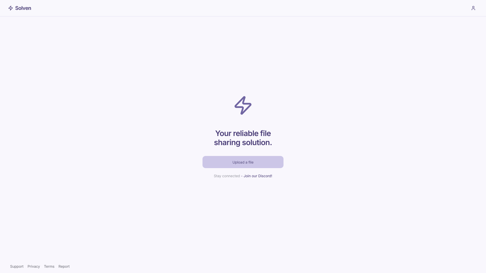

# Solven

Solven is a modern file sharing platform built with Next.js and HeroUI. It provides a simple and efficient way to upload, store, and share files with others.



## Features

- 🔒 Secure file sharing with end-to-end encryption
- 📱 Modern, responsive UI built with HeroUI
- ⚡ Fast file uploads and downloads
- 🔄 Automatic file deletion after 7 days of inactivity
- 👤 User authentication and account management
- 📦 Unlimited storage space
- 🚫 Content moderation and abuse reporting

## Tech Stack

- [Next.js 15](https://nextjs.org/) - React framework for production
- [HeroUI v2](https://heroui.com/) - Modern UI components
- [Tailwind CSS](https://tailwindcss.com/) - Utility-first CSS framework
- [TypeScript](https://www.typescriptlang.org/) - Type-safe JavaScript
- [Framer Motion](https://www.framer.com/motion/) - Animation library

## Getting Started

### Prerequisites

- Node.js 18.17 or later
- npm, yarn, or pnpm
- Cloudflare R2 account
- Neon Database account
- GitHub OAuth application
- Google OAuth application

### Installation

1. Clone the repository:

```bash
git clone https://github.com/d4vss/solven.git
cd solven
```

2. Install dependencies:

```bash
npm install
# or
yarn install
# or
pnpm install
```

3. Create a `.env` file in the root directory and add your environment variables:

```env
# Cloudflare R2 Configuration
R2_ACCESS_KEY_ID=your_r2_access_key_id
R2_SECRET_ACCESS_KEY=your_r2_secret_access_key
R2_BUCKET=your_bucket_name
R2_ACCOUNT_ID=your_account_id

# Database Configuration
DATABASE_URL=your_neon_database_url

# Authentication Configuration
AUTH_SECRET=your_auth_secret
AUTH_TRUST=true

# GitHub OAuth
AUTH_GITHUB_ID=your_github_client_id
AUTH_GITHUB_SECRET=your_github_client_secret

# Google OAuth
AUTH_GOOGLE_ID=your_google_client_id
AUTH_GOOGLE_SECRET=your_google_client_secret
```

4. Start the development server:

```bash
npm run dev
# or
yarn dev
# or
pnpm dev
```

The application will be available at `http://localhost:3000`.

## Project Structure

```
solven/
├── app/                    # Next.js app directory
├── components/            # Reusable components
└── public/               # Static assets
```

## License

Copyright © 2025 d4vss. All Rights Reserved.

This software and associated documentation files (the "Software") are the proprietary property of d4vss. The Software is protected by copyright laws and international copyright treaties, as well as other intellectual property laws and treaties.

No part of this Software may be reproduced, distributed, or transmitted in any form or by any means, including photocopying, recording, or other electronic or mechanical methods, without the prior written permission of d4vss.
