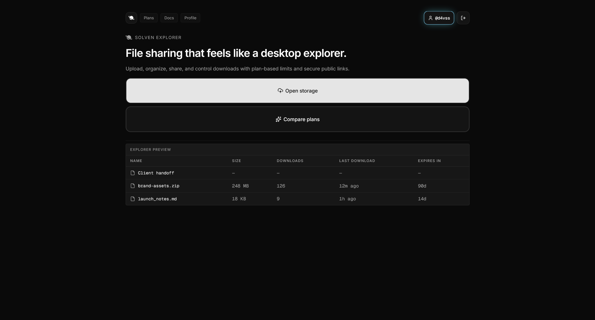

# Solven

Solven is a web application for file storage, sharing, and account management. It is built with Next.js (App Router), React, and TypeScript. Authentication is provided by Better Auth using GitHub and Google OAuth. Persistent data uses PostgreSQL with Drizzle ORM. File uploads and downloads use Cloudflare R2 over the S3-compatible API. Optional billing features integrate with Stripe.

Demo: [https://solven.d4vss.net](https://solven.d4vss.net)

Landing page (site root):



## Local development

```bash
bun install
bun run dev
```

The development server defaults to [http://localhost:3000](http://localhost:3000).

## Production build

```bash
bun run build
bun run start
```

## Deployment (Coolify, Nixpacks)

Use the Nixpacks builder with this repository; `nixpacks.toml` defines install, build, and start. Set production environment variables in Coolify, including any `NEXT_PUBLIC_*` values required at build time.

## License

See the `LICENSE` file in this repository.
